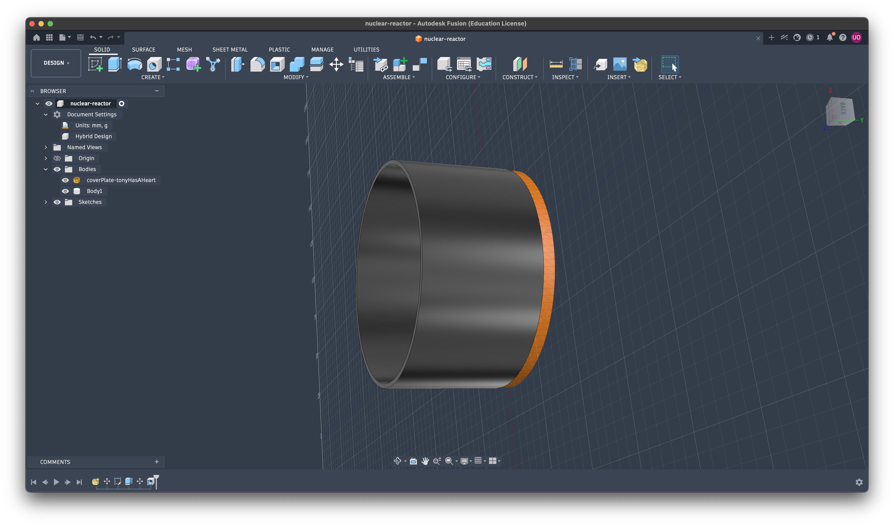

# JOURNAL
---
**Date: 18 Jun, 1:00am**

**Time Spent: 1hr 15min**

**What I Did:**

1. researched about the project like electronics needed, case, what other people have already made, etc.

2. made a few rough designs

rough design page #1

rough design page #2

3. went to sleep

---

**Date: 18 Jun, 12:30pm**

**Time Spent: 2hr**

**What I Did:**

1. finalised the component + rough design

2. found out how to make the case so that it can act as a diffuser

3. found the top design plate : iron man arc reactor one

[link to plate](https://www.printables.com/model/624553-wearable-arc-reactor/files)

4. started with the case:
- added the plate wrong
- re-added the plate
- made the main shell for the case

---

*Date: 18 Jun, 2:50pm**

**Time Spent: 1hr**

**What I Did:**

Made the back cover for the case

Steps I followed:
- made a list of all the holes I needed in the case
- found out the measurements for the components
- tried to add holes on the circular case side => could not fiugre it out
- decided to modify the design to include holes on the back cover only
- added hole for the slider spdt switch
- added hole for usb-c for charging module
- added tiny holes for the mic to catch the sound easily
- added a loop for the pendant ribbon

> note: the back cover of the case is attached usuing glue, and the components are also put in place using glue (i'm unable to can build housing fo reach component)

---