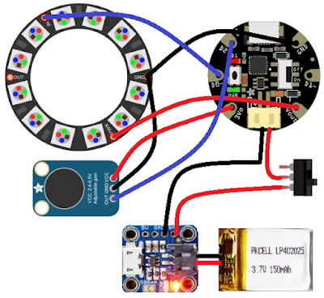
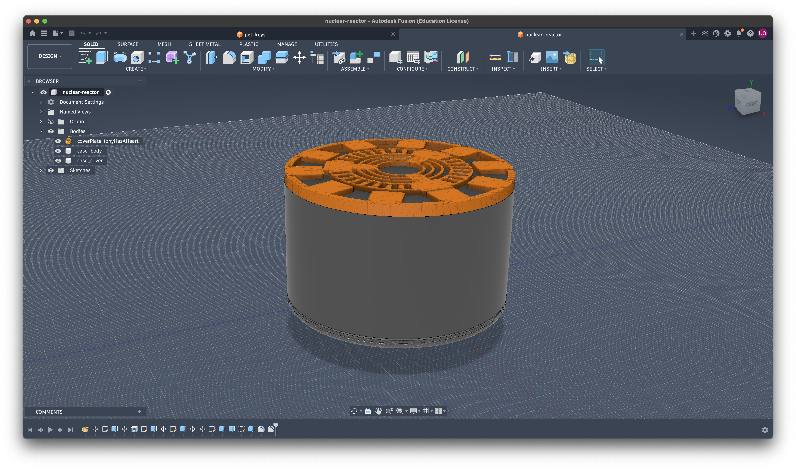
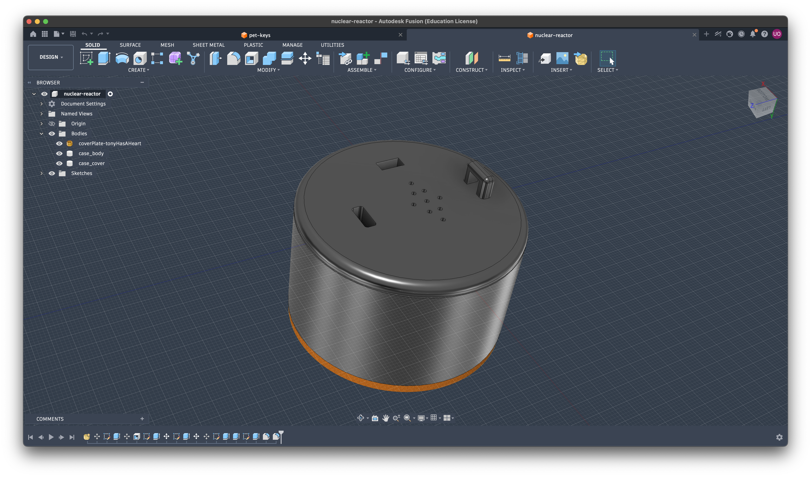
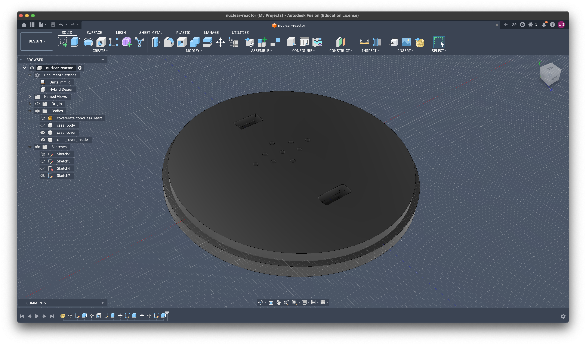

# nuclear-reactor
ironman's arc reactor themed sound responsive pendant

## Inspiration from:
Link: [link to youtube video](https://www.youtube.com/watch?v=0NRY9WaExDg)

## Features
- has a ironman arc reactor top plate
- the case should be translucent enough for light to shine through
- has rechargeable battery
- programmable leds to react to sound picked up from mic
- has a notch to attach ribbon to make it a pendant

## Schematics
> added a pdf file from kicad export in the 'schem' folder

## Case - 3D Printed

case assembled - top

case assembled - bottom

case lid

## BOM
| S. | Component                    | Quantity | Price (INR)     | Price (USD) | Link                                                                                                                            |
|----|------------------------------|----------|-----------------|-------------|---------------------------------------------------------------------------------------------------------------------------------|
| 1. | 3D Printed Case              | 1        | (shipping only) | -           | from printing-legion                                                                                                            |
| 2. | Xiao ESP32-S3                | 1        | 1034.00         | 10.96       | https://robocraze.com/products/seeed-studio-xiao-esp32-s3-development-board-supports-wi-fi-bluetooth-5-0?variant=47775391645920 |
| 3. | Slide Switch SPDT            | 1        | 9.00            | 0.095       | https://robocraze.com/products/slide-switch-3-pin-2-way-spdt?variant=44698610237664                                             |
| 4. | Rechargeable LiPo Battery    | 1        | 102.00          | 1.08        | https://robocraze.com/products/witty-fox-160mah-rechargeable-3-7v-lipo-battery?variant=47479826481376                           |
| 5. | WS2812 7-Bit Round LED Board | 1        | 89.00           | 0.94        | https://www.amazon.in/gp/product/B073DDRSLD/ref=ox_sc_act_title_1?smid=A31PUIOPHJ56Y3&psc=1                                     |
| 6. | MAX4466 Microphone Amplifier | 1        | 222.00          | 2.35        | https://www.amazon.in/gp/product/B0973CRZ25/ref=ox_sc_act_title_3?smid=A31PUIOPHJ56Y3&psc=1                                     |
| 7. | WS2812b LED Strip Lights     | 1        | 249.00          | 2.64        | https://www.amazon.in/gp/product/B0CXVKBRM8/ref=ox_sc_act_title_2?smid=A5EYW98BF5M8Q&th=1                                       |

**Total Cost**: 1705.00 INR = 18.07 USD (excluding shipping needed by printing legion)

> Note #1: need something around $20-$22 to cover any conversion tax + shipping by printing legion

> Note #2: conversion rate might change. one in BOM is as per google on 19 Jun 1:25am IST

> NOTE #3: had to get 1m led strip since couldn't find any that was shorter

## Credits
- made by me
- 3D case made in Fusion
- Schem in KiCad
- case top design plate from: [https://www.printables.com/model/624553-wearable-arc-reactor/files]